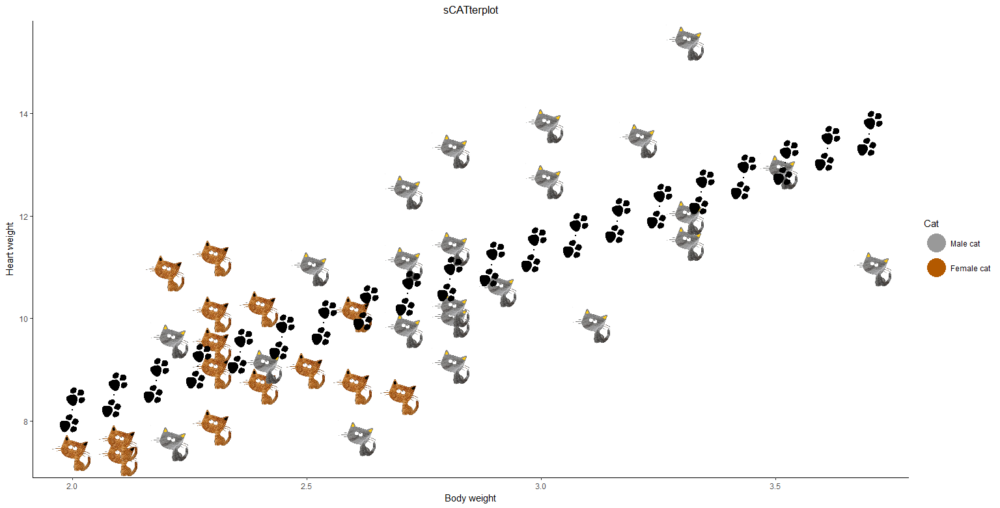

# sCATterplot
Clara Schartner, Data Scientist  


It will come as no surprise that cats and ggplot are among our favourite things here at mango. And there is an easy way to combine both:



Using the function `annotation_custom` of the popular ggplot2 package it is possible to display images on a plot as points of a scatterplot. This way data can be displayed in a more fun, creative way.  
In keeping with the cat theme I have chosen a data set about cats and a cat icon based on Mango the cat. The `MASS` package provides a data set called cats which contains the body weight, heart weight and sex of adult cats.


However since the data has 144 observations only a subset is used for the plot.


```r
library(MASS)
data(cats)
head(cats)
set.seed(1234)
cats <- cats[sample(1:144, size = 40),]
```

First a normal scatterplot is defined on which the images will be plotted later: 


```r
library(ggplot2)
sCATter <-ggplot(data = cats, aes(x = Bwt, y = Hwt)) +
  geom_point(size = 0, aes(group = Sex, colour = Sex)) +
  theme_classic() +
  xlab("Body weight") +
  ylab("Heart weight") +
  ggtitle("sCATterplot") +
  theme(plot.title = element_text(hjust = 0.5)) +
  # create a legend
  scale_color_manual(
    values = c("#999999", "#b35900" ),
    name = "Cat",
    labels = c("Male cat", "Female cat")
  ) +
  guides(colour = guide_legend(override.aes = list(size = 10)))
```

Any png image can be used for the plot, however images with a transparent background are preferable.  


```r
library(png)
library(grid)
mCat <- readPNG("MaleCat.png")
feCat<- readPNG("FemaleCat.png")
```

In the last step the cats are iteratively plotted onto the plot using `annotation_custom`.


```r
for (i in 1:nrow(cats)) {
  # distinguishing the sex of the cat
  if (cats$Sex[i] == "F") {
  image <- feCat
  } else{
  image <- mCat
  }
  sCATter = sCATter +
  annotation_custom(
    rasterGrob(image),
    xmin = cats$Bwt[i] - 0.6,
    xmax = cats$Bwt[i] + 0.6,
    ymin = cats$Hwt[i] - 0.6,
    ymax = cats$Hwt[i] + 0.6
  )
}
```


The cat´s paw trail is displaying a linear regression of heart on body weight. This can easily be added by computing a linear Regression, defining a grid to calculate the expected values and plotting cats on top of this data.


```r
LmCat <- lm(Hwt~Bwt, data = cats)

steps <- 20
Reg <- data.frame(Bwt = 
                    seq(from = min(cats$Bwt), 
                            to = max(cats$Bwt), 
                            length.out = steps))
Reg$Hwt <- predict(LmCat, newdata = Reg)
```


```r
sCATter <- sCATter + 
  geom_point(data = Reg, aes(Bwt, Hwt), size = 0)

paw <- readPNG("paw.png")
for (i in 1:nrow(Reg)) {
  sCATter = sCATter +
  annotation_custom(
    rasterGrob(paw),
    xmin = Reg$Bwt[i] - 0.6,
    xmax = Reg$Bwt[i] + 0.6,
    ymin = Reg$Hwt[i] - 0.6,
    ymax = Reg$Hwt[i] + 0.6
  )
}
sCATter
```
